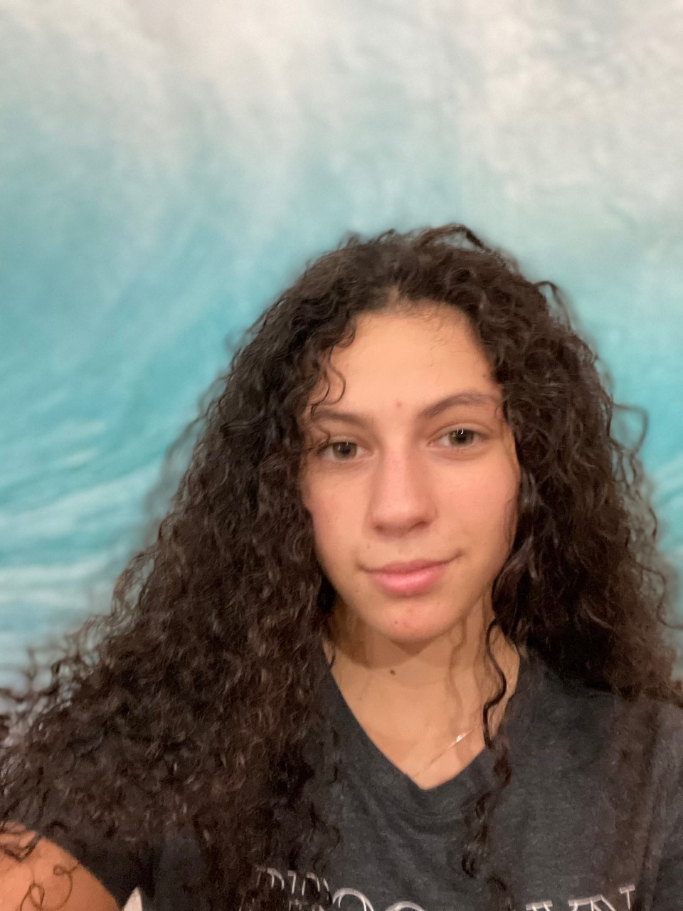

 

Today, I want to introduce myself.
I am Adi Beniluz, currently 15 years old. 
You should know are that I love ice hockey, soccer, snowboarding, and kitesurfing!
I am also interested in art and I love to draw nature and people, and create logos. 

This year, I have spent a few months babysitting for an amazing family.
I watch over and help out with a 3-month-old, a 2-year-old, and a 5-year-old.
This is honestly so fun and often the highlight of my day!

In school, I challenge myself. 
I take difficult courses that require hard work, such as AP United States History, 
AP Computer Science-A, and Honors Chemistry. It is important for me that I push myself.

